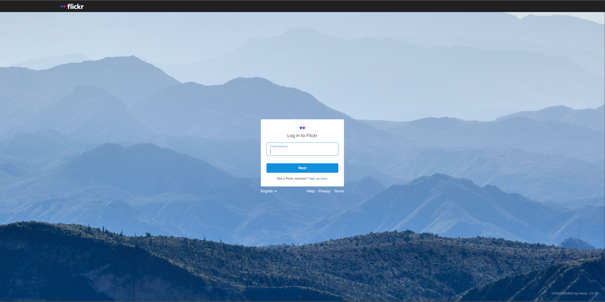
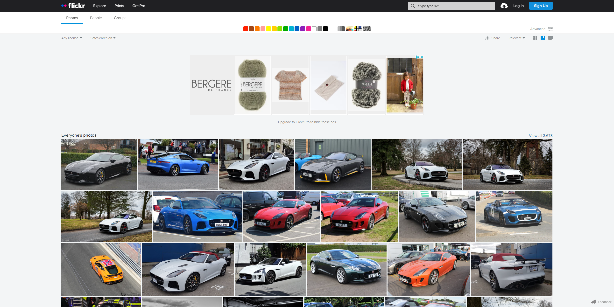

<h1 align="middle"> My Flickr </h1>

## Summary

* [Overview](#Overview)
* [Rules](#Rules)
* [Goals](#Goals)
* [Requirements](#requirements)
* [Credits](#Credits)

## Overview
This project goal is to create your copy of [Flickr](https://www.flickr.com/). You will find inside the [api]("/api") folder the necessary to run your own API instead of using the Flickr API.

## Rules

* You **MUST** create a git repository named `my-flickr`
* You **MUST** create a file called `.author`:

```sh
~/call-me-dev/learn-react/workshop/my-flickr ❯❯❯ cat -e .author
{
  "firstName": "Dylan",
  "lastName": "DE SOUSA"
}
```

## Goals

* Practice [React](https://reactjs.org/) basics: [props](https://reactjs.org/docs/components-and-props.html), [state](https://reactjs.org/docs/state-and-lifecycle.html), [jsx](https://reactjs.org/docs/introducing-jsx.html).
* Learn about [context](https://reactjs.org/docs/context.html) and how to share data across your components
* Learn how to link an API with a [React](https://reactjs.org/) application
* Learn about Navigation with [React-Router](https://reactrouter.com/)

## Requirements
We need at least two pages, the login and dashboard pages. Feel free to use any UI library (tailwindcss, bootstrap, bulma ...)
The pages shown here are only examples, you can style them as you want.

### Login


### Dashboard


## Credits

Made by **Call-Me-Dev**
